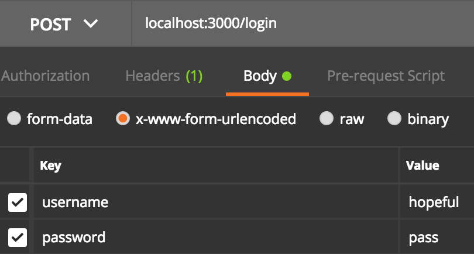
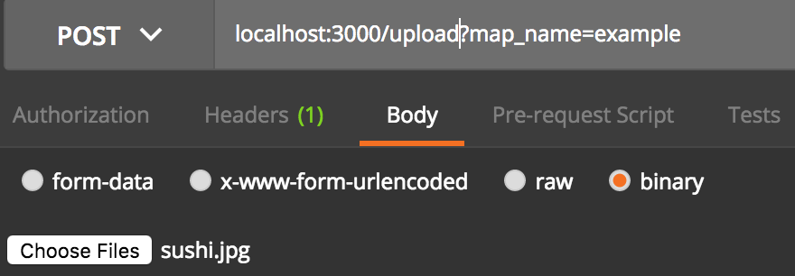

Install instructions
============
ssh into desired server
make sure git is installed
## install docker 
Use the commands below or see [source tutorial](https://www.digitalocean.com/community/tutorials/how-to-install-and-use-docker-on-ubuntu-16-04)
```bash
curl -fsSL https://download.docker.com/linux/ubuntu/gpg | sudo apt-key add -
sudo add-apt-repository "deb [arch=amd64] https://download.docker.com/linux/ubuntu $(lsb_release -cs) stable"
sudo apt-get update
apt-cache policy docker-ce
sudo apt-get install -y docker-ce
```
## check docker status
```bash
sudo systemctl status docker
```

## clone the node server repo
make the files accessible w/o super user access
```bash
sudo mkdir /var/www
sudo chmod 777 /var/www
git clone -b terrium_master https://github.com/NeuronSwarm/MultiGame-API.git /var/www/node_server
```

## build the docker image
first more permissions stuff
```bash
sudo groupadd docker
sudo gpasswd -a $USER docker
newgrp docker
```
```bash
docker build -t nodegameserver .
docker run -i -t -p 49160:3000 -d nodegameserver
```

## check for running image -- you should see one item in the list
```bash
docker ps
```

## check your browser for server dns or ip address on port 49160
You should see an unauthorized response from the server, so its working.

## Go inside the Docker container
get the <container_name> from docker ps
```bash
docker exec -it <container_name> /bin/bash
```

# FAQ
I will answer all endpoint questions in terms of Postman screenshots.
Replace `localhost:3000` with your domain name ie `example.com`

0) I keep getting no cookie data, you are not unauthorized.  How to fix?
    You need to submit a valid session id with each request(not including register or login endpoints).
    You can get this id from the body of the response from the server after successfully registering or loggin in.
    Each time you login, you get a new session id.

    

1) How do I register users?

    

2) How do I login myUser?

    

3) How do I upload a binary file to store on the server?
    Each clientside language is different, but this how Postman does it through their GUI
    Assign Name of the sushi.jpg binary file to `example`

    

4) How do I download a binary file by name?
    Request binary file named `example`

    

5) Where is the database config file?
    See the [configuration README](docs/configuration.md)

